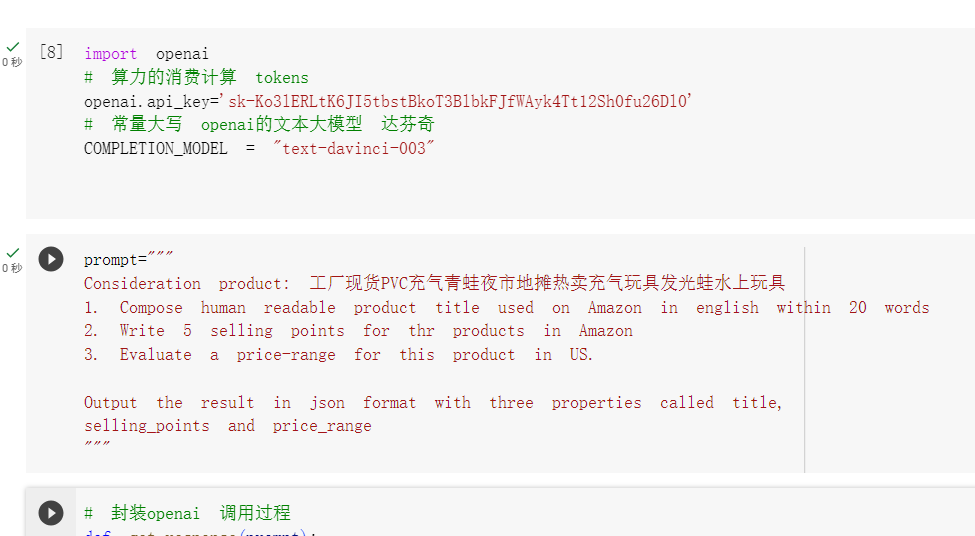
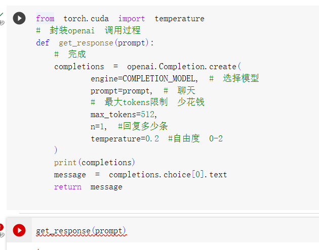
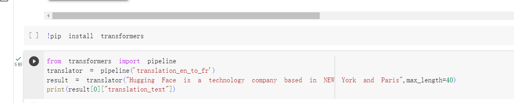

# 跨境电商

AI 开店
玩具店 -> 拼多多的海外版

- 需要翻译 不用goole翻译 可以使用NLP帮我们翻译，写程序
    pipeline('translate')
    AIGC 生成
- 买什么货
- 卖多少钱
- 营销内容怎么写有搞头

- 如何让openai帮你开店?
    大模型(openai 接口调用) + prompt engineer (编写prompt)

## prompt工程

会问问题的人比解决问题的人更强
因为现在大模型超越了大部分人的能力

## openai 封装的过程

人生苦短，我用python
特别适合NLP
一个功能写法就一种
风格 缩进
def get_response(prompt):
  调用了openai库的Commpletions模块（其他模块）
  向openai发出网络请求
  completions = openai.Completions.create(
    enginr=,
    prompt=, 吴恩达prompt
    temperature=0  **自由度**
    max_tokens=512

  )
  python语言是同步的，只有js是异步的

  print(completions)
  result = completions[0].chioces.text
  return result
  