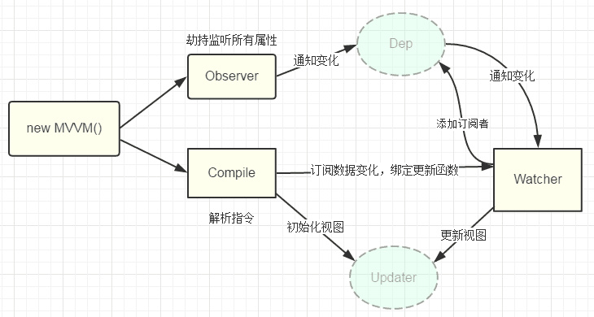

# 1.说说你对vue的理解

# 2.说说你对SPA的理解

# 3.说说你对双向绑定的理解
- 是什么
  - 模版层的数据发生变更会导致视图层的更新，视图层的变更也会导致模版层的数据更新
- 原理 ：也就是 ViewModel 的原理
  - 监听器：对所有的数据进行监听
  - 解析器：对每个元素节点的指令进行解析

- 双向绑定的理解
  - vue的数据源会被劫持，在劫持的过程中为属性做依赖收集。vue中的观察者Watcher负责更新视图，依赖收集到的是观察者Watcher的实例对象。
  当属性值发生变更时，会触发依赖，进而会触发视图更新函数。
  - 在数据劫持的同时，vue会编译模版，解析指令，当视图层的数据发生变更时，编译器中绑定的函数会被触发，
  进而获取到最新的数据值，再次通知Watcher去触发依赖，进而更新视图。

# 4.生命周期

# 5.组件之间的通信
  1. 父子组件通信：父组件通过props向子组件传递数据，子组件通过defineProps接收数据
  2. 子父组件通信：子组件通过emit触发事件，父组件通过v-on(@) 监听事件；或者通过provide/inject
  3. 子父组件通信：子组件拿到父组件的数据并修改后emit出来，父组件通过v-model实现双向绑定
  4. 子父组件通信：子组件defineExpose暴露方法，父组件通过ref读取整个子组件对象来获取值